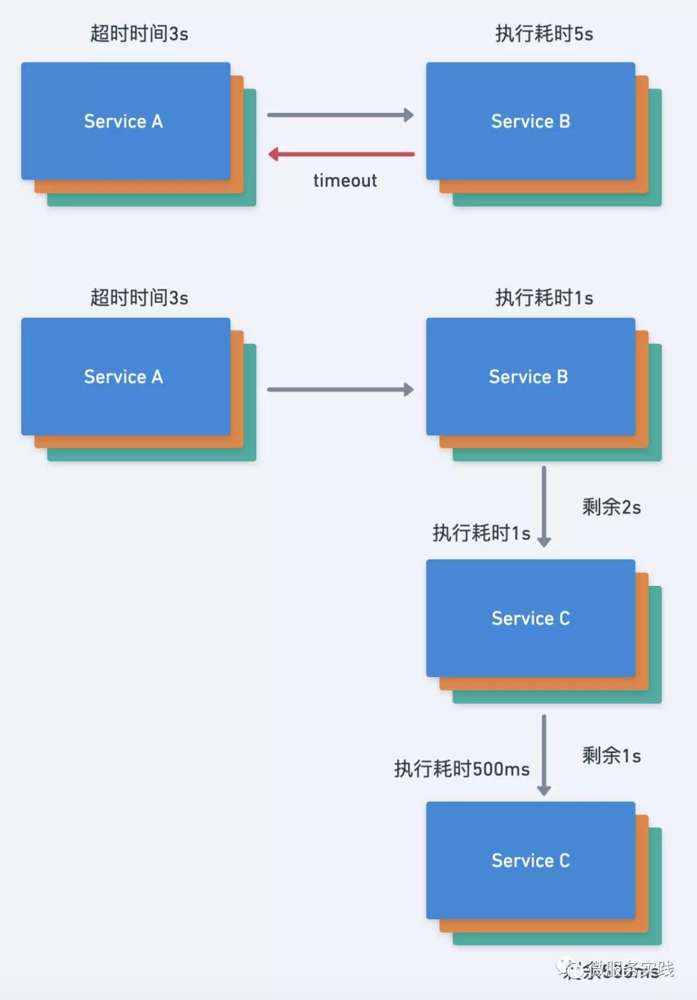

# 超时控制

## 为什么需要超时控制

很多连锁故障的场景下的一个常见问题是服务器正在消耗大量资源处理那些早已经超过客户端截止时间的请求，这样的结果是，服务器消耗大量资源没有做任何有价值的工作，回复已经超时的请求是没有任何意义的。

超时控制可以说是保证服务稳定性的一道重要的防线，它的本质是快速失败(fail fast)，良好的超时控制策略可以尽快清空高延迟的请求，尽快释放资源避免请求的堆积。

## SQL查询的超时控制

没有超时控制，一条SQL只有在拿到结果后才会结束。

如果这条SQL是一条慢SQL，或者客户端已经超时或取消了本次查询，那么继续执行SQL无疑在做无用功，对系统资源造成浪费。

### Query Without Timeout

```go
func TestWithoutTimeout(t *testing.T) {
	_, err := Connection.Query("SELECT sleep(10)")
	if err != nil {
		t.Error(err)
		return
	}

	t.Log("success")
}
```

```sql
+----+-----------------+-----------------+------------+---------+------+------------------------+------------------+
| Id | User            | Host            | db         | Command | Time | State                  | Info             |
+----+-----------------+-----------------+------------+---------+------+------------------------+------------------+
|  5 | event_scheduler | localhost       | NULL       | Daemon  | 1272 | Waiting on empty queue | NULL             |
|  9 | root            | localhost:51166 | NULL       | Sleep   |   47 |                        | NULL             |
| 16 | root            | localhost       | NULL       | Query   |    0 | init                   | SHOW PROCESSLIST |
| 17 | root            | localhost:51448 | gongjiayun | Query   |    0 | User sleep             | SELECT sleep(10) |
+----+-----------------+-----------------+------------+---------+------+------------------------+------------------+
```

模拟10s的慢查询，10s内客户端主动取消本次查询`CTL C`，可以看到数据库查询依然在继续。

### Query With Timeout

```go
func TestWithTimout(t *testing.T) {
	ctx, cancel := context.WithTimeout(context.Background(), 3*time.Second)
	defer cancel()

	_, err := Connection.QueryContext(ctx, "SELECT SLEEP(10)")
	if err != nil {
		t.Error(err)
		return
	}

	t.Log("SUCCESS")
}
```

加入超时控制后， 超时后会主动结束本次查询进程。

## 服务间超时控制

如果一个请求有多个阶段，比如由一系列 RPC 调用组成，那么我们的服务应该在每个阶段开始前检查截止时间以避免做无用功，也就是要检查是否还有足够的剩余时间处理请求。

一个常见的错误实现方式是在每个 RPC 服务设置一个固定的超时时间，我们应该在每个服务间传递超时时间，超时时间可以在服务调用的最上层设置，由初始请求触发的整个 RPC 树会设置同样的绝对截止时间。例如，在服务请求的最上层设置超时时间为3s，服务A请求服务B，服务B执行耗时为1s，服务B再请求服务C这时超时时间剩余2s，服务C执行耗时为1s，这时服务C再请求服务D，服务D执行耗时为500ms，以此类推，理想情况下在整个调用链里都采用相同的超时传递机制。



如果不采用超时传递机制，那么就会出现如下情况：

* 服务A给服务B发送一个请求，设置的超时时间为3s
* 服务B处理请求耗时为2s，并且继续请求服务C
* 如果使用了超时传递那么服务C的超时时间应该为1s，但这里没有采用超时传递所以超时时间为在配置中写死的3s
* 服务C继续执行耗时为2s，其实这时候最上层设置的超时时间已截止，如下的请求无意义
* 继续请求服务D 

如果服务B采用了超时传递机制，那么在服务C就应该立刻放弃该请求，因为已经到了截止时间，客户端可能已经报错。我们在设置超时传递的时候一般会将传递出去的截止时间减少一点，比如100毫秒，以便将网络传输时间和客户端收到回复之后的处理时间考虑在内。